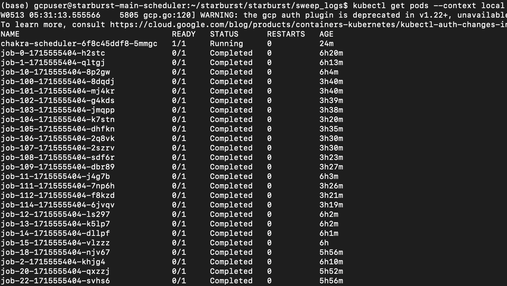
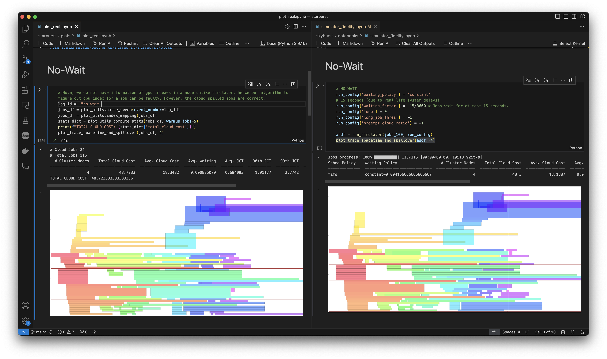
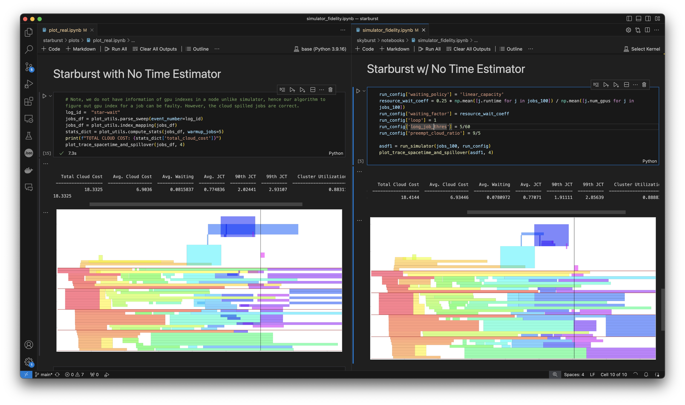
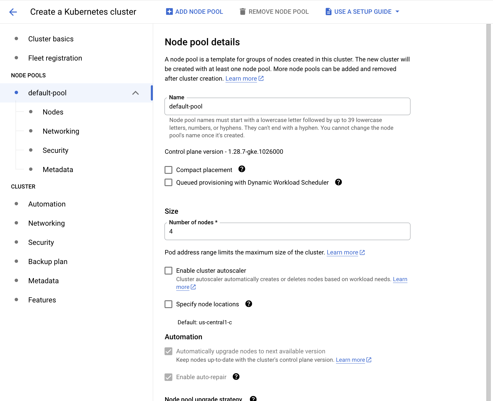
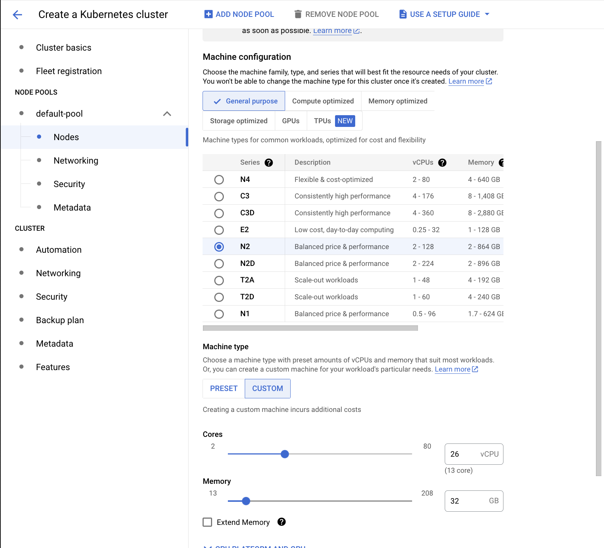

# Starburst ⭐: A Cost-aware Scheduler for Cloud Bursting

**Usenix ATC'24 Artifact Evaluation**

# Abstract

This guide is designed you to set up, run experiments, and replicate evaluation for Starburst. We split this document into 3 sections:

- **Setup**: How to setup Starburst in your Python environment or get set up with our provided VM.
- **Simulator Exps**: Run all our simulation experiments and replicate/plot our results.
- **Real-World Exps**: Run our Starburst scheduler over a Kubernetes cluster (acting as on-prem) and run a job submission pipeline. We place this last, as each run takes 3-5 hours and is fairly complex.

# Goals

For simulation, the reviewer will be able to:
- Run all simulation experiments for all figures and tables
- Plot out the same figures provided in the Starburst paper

 We provide run scripts in `~/starburst/simulator_scripts` and plotting notebooks in `~/starburst/skyburst/notebooks` to replicate our results.

For real world evaluation, our goal is two fold:
- Show that Starburst can save between 54-91\% costs (in fact we show that we save ~65\% for this artifact)
- Show that our real system closely mimics simulation.

 Run scripts are in `~/starburst/starburst/sweep` and evaluation scripts are in `~/starburst/starburst/plots`, which shows that Starburst saves > 50\% costs. To perform a 1-to-1 comparison with simulation, we evaluate real-system and simulator alignment in `~/starburst/starburst/notebooks/simulation_fidelity.ipynb`.

## Caveats

Our real-world experiments evaluated Starburst over a 4 node, 8 V100/node GKE cluster acting as the local cluster with real ML training jobs, which was prohibitively expensive to run. To reduce costs, our artifact evaluation approximates our original experiments with a 4 node, 24 CPU/node GKE cluster, where 1 GPU = 3 CPUs.

# Setup

We provide several options for the evaluator to install Starburst. For simulation, users can run our simulation experiments either on their laptop/server or our provided VM. However, for real-world experiments, we highly suggest the evaluators run our scripts in our provided SSH VM, which is connected to a provisioned Kubernetes cluster acting as the "local cluster".

## 1. Python Setup

Our codebase requires Python >= 3.9. To install dependencies for Starburst, run:
```
cd ~/
git clone --recurse-submodules https://github.com/michaelzhiluo/starburst.git
cd starburst
pip install -r requirements.txt
pip install -e .
```

Install `git-lfs` by following the instructions listed [here](https://docs.github.com/en/repositories/working-with-files/managing-large-files/installing-git-large-file-storage)

Install the Philly and Helios traces with the following code below:
```
cd ~/
git lfs clone https://github.com/msr-fiddle/philly-traces.git
cd philly-traces
tar -xvf trace-data.tar.gz 

cd ~/
git lfs clone https://github.com/S-Lab-System-Group/HeliosData
cd HeliosData
unzip data.zip
```

Finaly, move the provided Gurobi license file to `~/gurobi.lic`. One of our experiments uses Gurobi to solve a mixed integer linear program (MILP). 

## 2. SSH to VM

We also provide our private key and IP address of our VM for evaluators to run experiments in our VM, which already has everything setup! The VM contains the repositories for both simulator, real-world system (Kubernetes cluster), Gurobi, and the Philly/Helios traces.

**Update: The IP address of our provided VM is `34.28.191.123`.**

For best expereince, we recommend linking VSCode remote explorer with the SSH'ed VM by modifying the SSH config file `~/.ssh/config`:

```
Host starburst
  HostName [IP_ADDRESS]
  User gcpuser
  IdentityFile [PATH_TO_PRIVATE_KEY]
  IdentitiesOnly yes
  ForwardAgent yes
  StrictHostKeyChecking no
  UserKnownHostsFile=/dev/null
  GlobalKnownHostsFile=/dev/null
  Port 22
```

# Simulation Experiments

All our simulation code is in `skyburst` directory. We note that all our simulators logs for all our experiments (including Appendix) are saved in a public Google Cloud Storage bucket: `gs://starburst_bucket/logs`. If the user wants to save time, all our results can be directly fetched from this bucket and directly plotted with the Jupyter notebooks provided in `skyburst/notebooks`. 

To do so, install Gcloud on your machine and run the following command to pull the logs from the bucket:
```
# Will download the logs to ~/log
gsutil -m cp -r gs://starburst_bucket/logs ~/
```

However, we also provide bash commands below to generate the logs for each figure below. This is also provided in the repo, in `skyburst/simulator_scripts`. Note that these experiments can take minutes to several hours to complete on a 48 CPU machine. We note that the Pareto curve experiments and the optimal MILP experiment takes the longest.

## Fig 7: End2End Simulator Results

To run End2End experiments with both Philly and Helios traces, run:
```
simulator_scripts/fig7.sh
```

This will output logs to the path `~/logs/philly_end2end.log` and `~/logs/helios_end2end.log`.
Use `skyburst/notebooks/fig7_simulator_end2end.ipynb` to plot the graphs with the corresponding logs.

## Fig 8: End2End Pareto Curves

To run End2End pareto curve experiments with both Philly and Helios traces, run:
```
simulator_scripts/fig8.sh
```

This will output logs to the path `~/logs/philly_pareto.log` and `~/logs/helios_pareto.log`.
Use `skyburst/notebooks/fig8_pareto_ipynb.ipynb` to plot the graphs with the corresponding logs.


## Fig 9: Ablation over Waiting Policies.

To run ablations over different waiting policies, run:
```
simulator_scripts/fig9.sh
```

This will output logs to the path `~/logs/ablate_waiting_policies.log`.
Use `skyburst/notebooks/fig9_ablate_waiting_policy.ipynb` to plot the graphs with the corresponding logs.


## Fig 10: Ablation over Pareto Curves

To run ablations over the pareto curves for different waiting policies and out-of-order scheduling, run:
```
simulator_scripts/fig10.sh
```

This will output logs to the path `~/logs/ablate_waiting_policies_pareto.log` and `~/logs/ablate_out_of_order_pareto.log`.
Use `skyburst/notebooks/fig10_ablate_pareto.ipynb` to plot the graphs with the corresponding logs.

## Fig 11: Ablation over Out-of-Order Scheduling

To run ablations over out-of-order scheduling, run:
```
simulator_scripts/fig11.sh
```

This will output logs to the path `~/logs/ablate_out_of_order.log`.
Use `skyburst/notebooks/fig11_ablate_out_of_order.ipynb` to plot the graphs with the corresponding logs.


## Fig 12: P90/P99 Waiting Times

To run experiments over the 90th and 99th percentile waiting times, run:
```
simulator_scripts/fig12.sh
```

This will output logs to the path `~/logs/ablate_jct_percentile.log`.
Use `skyburst/notebooks/fig12_ablate_jct_percentile.ipynb` to plot the graphs with the corresponding logs.


## Fig 13: Ablate Waiting Budget

To run ablations over our waiting budget framework, run:
```
simulator_scripts/fig13.sh
```

This will output logs to the path `~/logs/ablate_philly_waiting_budget.log` and `~/logs/ablate_helios_waiting_budget.log`.
Use `skyburst/notebooks/fig13_ablate_waiting_budget.ipynb` to plot the graphs with the corresponding logs.

## Table 4: MILP Experiments

Our MILP experiments requires access to GUROBI, a popular mathematical optimization solver. However, Gurobi requires a license. We provide our license to the artifact evaluators in `gurobi.lic`.

### Setup Gurobi

The Gurboi Optimizer should already be installed from setting up the Python dependencies. To provide the license, place your `gurobi.lic` file in `/opt/gurobi` or your home directory. 

See `skyburst/notebooks/tab4_optimal_solver.ipynb` to run the MILP and evaluate it against Starburst and other baselines. Our experiments run the MILP for 8 hours; we recommend the reviewer to try either 4 or 8 hours. 

To run a headless version of the notebook, use the following command:
```
jupyter nbconvert --to notebook --execute 'skyburst/notebooks/tab4_optimal_solver.ipynb'--ExecutePreprocessor.timeout=-1
```

We also plot Gantt charts to show which jobs run on cluster and on cloud. An example is provided below, with captions to correctly interpret the Gantt chart:


## Fig 14: Starburst w.r.t Bursty Workloads

To run ablations over bursty workloads (Starburst w.r.t different Coefficient of Variances for a Gamma arrival distribution), run:
```
simulator_scripts/fig14.sh
```

This will output logs to the path `~/logs/burst.log`.
Use `skyburst/notebooks/fig14_ablate_robustness.ipynb` to plot the graphs with the corresponding logs.

## Fig 15: Queueing and Binpacking Policies

To run pareto curves for Starburst over different queueing and binpacking policies, run:
```
simulator_scripts/fig15.sh
```

This will output logs to the path `~/logs/sched_alg_pareto.log` and `~/logs/binpack_pareto.log`.
Use `skyburst/notebooks/fig15_ablate_queue_binpack.ipynb` to plot the graphs with the corresponding logs.


# Real System Experiments

Our real system is implemented in `~/starburst/starburst`. The general directory structure generally follows:
- `starburst/cluster-managers` - Compatibility layer for different Cluster managers, including Kubernetes, Skypilot, and simply logging to a file.
- `starburst/drivers` - Driver to launch Starburst's higher-level scheduler and submit job script to submit jobs to our higher level scheduler.
- `starburst/event_sources` - General GRPC classes to handle message passing to Starburst.
- `starburst/plots` - Our plotting code for sweep experiments, `plot_real.ipynb`.
- `starburst/sweep` - Runs job submission over Starburst scheduler for long periods of times. Keeps track of running statistics, including job runtime, start time, and wait time.
- `starburst/sweep_examples` - Example configs to run jobs over the Starburst scheduler with different scheduling policies.

**We suggest running real-world experiments in our provided SSH VM, which has access to the 4 node, 24 CPU GKE cluster as our local cluster.**

## Assumptions

- Due to our team vastly exceeding our allocated lab budget, the real world experiments will simulate a 4 node, 8 GPU/node on-premise Kubernetes (GKE) cluster with a **4 node, 24 CPU/node Kubernetes cluster** to significantly reduce costs, where 1 GPU is equivalent to 3 CPU job. We will leave this GKE cluster on for the entirety of the artifact evaluation period.
- Insteading of provisioning cloud resources with Skypilot, cloud-running jobs are sent to a log file instead to further reduce costs and to avoid hitting cloud quota limits. You can see them in `~/starburst/starburst/sweep_logs/[RUN_ID]/events/0.log`.
- We run sleep jobs as opposed to training jobs, as there are no GPUs to run training. The sleep jobs are sampled from real-world training jobs, with the sleeping duration equivalent to the predicted runtime of training jobs.

## Setup Kubernetes Cluster

We provide two options for users to setup the local Kubernetes cluster. The first option is directly SSH'ing to our provided VM, which has the Kubernetes cluster setup, and running the experiments. The second option is for the user to create a GKE cluster on their own, and the steps to do so is provided in the Miscellaneous section at the bottom of this README file.

## Running Real-World Experiments

To run our real-world experiments, we use [Chakra](https://github.com/michaelzhiluo/chakra/tree/fa4799bfc67ea983936b7c88864cbe35719eca0f) as a scheduling plugin for Kubernetes. If you cloned without installing the submodules, use the following command to pull Chakra into the Starburst repo:
```
git submodule update --init --recursive
```

Before launching runs, the reviewer should make sure that the image `gcr.io/sky-burst/skyburst:latest` is cached on all nodes (pre-pulled) of the Kubernetes cluster. This ensures that there is no `ContainerCreating` state, which introduce container download delays and is not modeled in our simulator. Run:

```
# Ensures all images are already pulled onto each Kubernetes node. You may need to run this multiple times!
./real_scripts/cache-images.sh
```

There are a total of four runs - for No-Wait, Constant-Wait, Starburst, and Starburst without a time estimator (No-TE). Each run will submit jobs over a 3 hour time window, taking a total of ~3-5 hours to complete and wait for all jobs to finish. Our scripts re-deploys Chakra, the scheduler plugin for  Kubernetes, launches Starburst's higher level scheduler, and the job submission services.

We note that the runs **must be ran sequentially**, as there is only one cluster. To launch our runs:
```
# Ideally run this as a background process (such as in Tmux or Screen).
# No-Wait - ./real_scripts/no-wait.sh
# Constant-Wait - ./real_scripts/constant-wait.sh
# Starburst - ./real_scripts/starburst.sh
# Starburst (No-TE) - ./real_scripts/starburst-note.sh
./real_scripts/no-wait.sh
```

**While the run is executing, progress of jobs submitted thus far can be visualized with `kubectl get pods`. If any job/pods are in `PENDING` state on the Kubernetes cluster, that means Chakra has errored. Please restart the run by rerunning the bash command.** 

Finally, after each run, the runs logs needs to be post-processed. **Each run will log its outputs to `~/starburst/starburst/sweep_logs/[RUN_ID]`, where `RUN_ID` is a timestamp. We strongly empahsize to NOT LAUNCH the next run before processing logs below. Otherwise, the script will not be able to fetch information from the jobs on the K8 cluster.** To launch our post-processing script, run:
```
cd ~/starburst/starburst/sweep
python process_logs.py --log_path ../sweep_logs/[RUN_ID]
```

If the steps above were followed correctly, both the Chakra deployment and the submitted jobs should be visible when running `kubectl get pods`:



## Plotting Real-World Experiments

Similar to our simulator, we also have precomputed sweep logs in our storage bucket `gs://starburst_bucket/sweep_logs`. However, sweep logs can still be generated in the above section. If the user wants to try out our data, download the sweep logs into the Starburst repository:

```
# Will download the our sweep logs to Starburst.
gsutil -m cp -r gs://starburst_bucket/sweep_logs ~/starburst/starburst/
```

Follow the instructions in the notebook `~/starburst/starburst/plots/plot_real.ipynb` to get cloud costs and plot Gantt charts for all runs. To compare the real-life runs with our simulator, the simulator fidelity notebook can be found in `~/starburst/skyburst/notebooks/simulator_fidelity.ipynb`.

We note that for our provided logs (and if reviewers also want to run and create their own logs), the costs between simulator and our real-world results are very similar. On the left side of the images below is our real-life experiments (`starburst/plots/plot_real.ipynb`) and the right side is our simulation of the real-world experiments (`skyburst/notebooks/simulator_fidelity.ipynb`). See `images/gantt.svg` to understand the Gantt charts below.

For No-Wait, both our real-life system and simulator achieve similar costs -  48.72 versus 48.3. 



For Starburst, both our real-life system and simulator also achieve similar costs - 18.33 vs 18.41.



Most notably, in this example, Starburst reduces costs by around **100% * (1 - 18.33/48.72) = 62.37%**, which validates our paper's claims.

## Miscellaneous

### Provisioning a Kubernetes cluster.

While we provide a GKE cluster in our provided VM, we also provide steps for evaluator to independently provision their own GKE cluster for evaluation.

1) Browse Google Cloud console and enable Google Kubernetes Engine (GKE) service. 

2) Click create to generate a new GKE cluster and choose standard (not Autopilot) GKE cluster.

3) Click the default-pool tab under 'Node Pools' and change number of nodes to 4.



4) Go to nodes under default-pool. Click N2 for CPUs and set the custom number of CPUs to be 26 vCPUs. As Kubelet occupies some resources on each node, our actual GKE cluster size is ~25 vCPUs, leaving 1 vCPU available when all CPUs (3x8) are scheduled by Starburst.



5) Create the new GKE cluster and fetch the Kube config from Google Cloud:

```
sudo apt-get install google-cloud-sdk-gke-gcloud-auth-plugin
gcloud container clusters get-credentials [CLUSTER_NAME]
```

6) This will generate a Kubernetes configuraton in `~/.kube/config`. Fetch the name of the cluster in the `~/.kube/config`. For us, the name followed this format: `gke_[PROJECT_NAME]_[ZONE]_[CLUSTER_NAME]`. Rename the cluster to the name `local` with the following command:

```
kubectl config rename-context [CLUSTER_NAME] local
```

7) If all steps are correct, `kubectl get pods --context local` should run without error.

8) Finally,  to ensure fidelity with our simulator, our experiments assume the container image is cached on each node of the cluster. To make sure all images are on the machine, run the following bash script in `starburst/real_scripts`:
```
./real_scripts/cache-images.sh
```
This will submit jobs to all nodes in the cluster and initiate the container pulling process.


### Starburst System Config

We provide an example sweep config below to help evaluators better understand our system. These configs are in `starburst/sweep_examples`.
```
# Sweep Parameters
workload_type: artifact_eval # Artifact Evaluation workload consists of sleep jobs that are sampled from real-world training jobs (Sec 6.2).
submit_time: 10800 # Submitting jobs over a 3 hour (10800s), period.
random_seed: 13

# Job generation parameters
arrival_dist: poisson
# 24 for s=0.75, 32 for s=1.1
arrival_param: 32 # 32 Jobs/hour
min_arrival_time: 3
mean_duration: 2700 # Avg job is 45 minutes (2700s) long, sampled from exponential distribution.
min_duration: 30 # Clip job runtimes.
max_duration: 10000 # Clip job runtimes.
gpu_dist: [0.7, 0.15, 0.1, 0.05] # Philly Distribution (Percentage of jobs that have X GPUs)
gpu_sizes: [1, 2, 4, 8]
image: gcr.io/sky-burst/skyburst:latest # Our public image contains 

# Policy Parameters
waiting_policy: [zero] # Waiting policy, can be infinite, constant, compute, star
waiting_coeff: -1 # Coefficient to waiting policy
waiting_budget: 0.25 # Waiting policy's waiting budget - this will be used to compute and override waiting_coeff if specified.
queue_policy: fifo # Order of the queue (FIFO).
loop: False # Enable out-of-order scheduling. Used for compute and star waiting policies.
min_waiting_time: 15 # Minimum waiting time (in seconds) for all jobs (to avoid concurrency bugs).
 
# Cluster Parameters
clusters:
  # On-premise cluster config.
  onprem:
    cluster_type: k8
    cluster_name: local # The name of the Kubernetes cluster in `~/.kube/config`.
  # Cloud cluster config.
  cloud:
    cluster_type: log # Can also be skypilot or another K8 cluster.
    cluster_name: cloud
```
